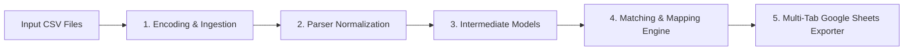

# finlog: High-Level System Design & Architecture Plan

## 1. Overview & Goals

`finlog` is a Python-based CLI tool designed to automate personal finance log management and credit card reconciliation. 
The primary objective is:
> Compare personal finance logs (e.g. Zaim exports) with actual credit card statement CSVs (such as ANA VISA Platinum, Amex Proper) to confirm transactions are accurately logged, identify unmatched or suspicious card charges, and output structured verification views to Google Spreadsheets.

The system is designed with a modular architecture so it can be easily extended in the future for multi-card providers, new expense platforms (e.g. MoneyForward), and yearly tax reporting features.

---

## 2. Directory & Module Structure

```text
dev/finlog/
├── README.md                   # User setup and CLI usage guide
├── pyproject.toml              # Project metadata & dependencies (managed via uv)
├── docs/
│   ├── credit/                 # Credit card reconciliation documentation
│   │   ├── design_plan.md      # High-level architecture & system design plan
│   │   └── schema/
│   │       ├── zaim_schema.md  # Zaim raw/preprocessed schema
│   │       ├── amex_schema.md  # Amex card CSV schema
│   │       ├── visa_schema.md  # ANA VISA card CSV schema
│   │       └── intermediate_schema.md # Unified intermediate model schema
│   └── tax/                    # Tax & GSU reporting documentation
│       ├── design_plan.md      # GSU tax architecture & implementation plan
│       └── schema/
│           └── input_schemas.md# Vests, Dividend, Sales, and Carryover schemas
├── finlog/                     # Core Python package
│   ├── __init__.py
│   ├── config.py               # Static configuration constants (e.g. DRIVE_FOLDER_ID)
│   ├── cli.py                  # Click CLI entrypoint with credit and gsu subcommands
│   ├── io/
│   │   ├── csv_reader.py       # Encoding-aware CSV reader (UTF-8, Shift_JIS/CP932)
│   │   └── sheets_writer.py    # Google Sheets API exporter (gspread + OAuth)
│   ├── parsers/
│   │   ├── base.py             # Abstract Base Parser
│   │   ├── zaim.py / amex.py / visa.py / tax.py
│   ├── models/
│   │   ├── transaction.py      # Transaction models for credit reconciliation
│   │   └── tax.py              # Tax dataclasses & CarryoverState model
│   ├── matching/               # Matching engine & strategies
│   └── tax/                    # GSU tax engine & FX provider
└── tests/                      # Pytest unit & integration test suite
```

---

## 3. Data Flow & Processing Pipeline

The processing pipeline follows a 5-stage sequential architecture:



### Stage 1: Ingestion & Encoding Handler (`finlog.io.csv_reader`)
- Safe decoding attempting `utf-8` and `cp932` (Shift_JIS).
- Guarantees all internal data processing operates on sanitized Python strings / UTF-8 objects.

### Stage 2: Source Parsers (`finlog.parsers`)
- **`BaseParser` (`finlog/parsers/base.py`)**:
  Abstract base class (`abc.ABC`) providing parsing utilities:
  - `clean_amount`: Sanitizes currency strings into signed `int` JPY (strips commas `","`, quotes, whitespace).
  - `clean_string`: Performs NFKC Unicode normalization, strips full-width/half-width spaces, and handles empty values.
  - `parse_date`: Parses diverse date formats (`YYYY-MM-DD`, `YYYY/MM/DD`).
  - `generate_transaction_id`: Formats unique primary IDs (`VISA-00001`, `ZAIM-00001`).
- **`ZaimParser`**: Ingests Zaim UTF-8 CSV exports.
- **`AmexParser`**: Handles `cp932` encoding, cleans full-width merchant spaces, removes string commas, and extracts cardholder names (`RYOSUKE TACHIBANA` vs `YURI TACHIBANA`).
- **`VisaParser`**: Handles `cp932` encoding, strips metadata header (Line 1) and footer total summary (Line N), mapping headerless CSV columns to structured objects.

### Stage 3: Data Models & Domain Architecture (`finlog.models.transaction`)

Two domain dataclasses manage data representation cleanly:

1. **`CreditCardTransaction`**:
   - Holds card statement attributes: `transaction_id`, `card_company`, `date`, `amount`, `payee_merchant`, `cardholder`, `card_number_suffix`, `note`, `raw_row_index`.
2. **`FinanceLogTransaction`**:
   - Retains Zaim budgeting metadata: `transaction_id`, `platform`, `type` (`expense`/`income`/`transfer`), `date`, `year`, `month`, `account` (e.g. `ANA VISA Platinum Unpaid`), `amount`, `category`, `subcategory`, `item`, `payee_payer`, `tag_raw`, `tag_mod`, `note`.

### Stage 4: Reconciliation & Account Mapping Engine (`finlog.matching.engine`)

#### Card-to-Zaim Account Mapping (`CARD_ACCOUNT_MAPPINGS`)
To match credit card statements against appropriate Zaim accounts (such as unpaid liabilities vs paid accounts), `finlog/matching/engine.py` maintains a central mapping structure:

```python
CARD_ACCOUNT_MAPPINGS = {
    "ANA VISA Platinum": {
        "unpaid": ["ANA VISA Platinum Unpaid"],
        "paid": ["ANA VISA Platinum Paid"],
    },
    "Amex Proper": {
        "unpaid": ["Amex Proper Unpaid", "Yuri Amex Proper Unpaid"],
        "paid": ["Amex Proper Paid"],
    },
}
```

- **Unpaid Account Focus**: By default (`unpaid_only=True`), reconciliation matches card transactions exclusively against Zaim's `Unpaid` accounts for that specific card.
- **Include All Accounts**: Passing `--include-all-accounts` includes both `Unpaid` and `Paid` accounts in candidate search.

#### 2-Phase Matching Architecture
Matching uses a sequential 2-phase architecture to maximize accuracy:

1. **Phase 1: 1-to-1 Exact Matching**:
   Validates pairs using hard constraints followed by soft scoring:
   - **Hard Constraints**: Exact Amount Match (`abs(card.amount) == abs(zaim.amount)`), Account Alignment (`zaim.account` in `allowed_accounts`), Date Window Tolerance ($\pm 5$ days).
   - **Multi-Score Weighting**: $S_{\text{total}} = 0.4 \times S_{\text{date}} + 0.6 \times S_{\text{text}}$ (where $S_{\text{text}}$ uses native alias mappings from `finlog/matching/merchant_map.json`). Pairs with $S_{\text{total}} \ge 0.4$ are accepted; highest score wins.

2. **Phase 2: Many-to-One (N:1) Bundled Matching**:
   Executes exclusively on remaining unmatched card and Zaim transactions to reconcile bundled charges (e.g. ¥100 + ¥200 Zaim entries matching a single ¥300 card charge):
   - **Exact Filters**: Filters unmatched Zaim candidates sharing exact account, exact date (`card_tx.date == zaim_tx.date`), and exact normalized merchant (`normalize(payee)`).
   - **Subset-Sum Search**: Searches for a subset of 2 to 5 Zaim transactions whose sum matches the single credit card charge amount.
   - **Output Status**: Bundled matches receive status `Matched (Bundled)` in both `Credit View` (with comma-separated Zaim IDs) and `Zaim View`.

---

## 5. Output Sheets Architecture (4-Tab Layout)

The exporter (`finlog.io.sheets_writer`) creates a streamlined **4-Tab Google Spreadsheet** (or local CSV fallback directory):

1. **`Raw Credit Card Log`**: Raw CSV entries parsed via `csv.reader` and sorted by transaction date in ASC order (older date first), while preserving top non-transaction header/metadata rows and bottom summary footer rows.
2. **`Raw Zaim Log`**: Raw Zaim CSV entries directly parsed as 2D cell arrays via `csv.reader`.
3. **`Zaim View`**: All Zaim entries sorted by date. Features `transaction_id` in the **leftmost column** and reconciliation status (`match_status`, `matched_transaction_id`) in the **rightmost columns**. Zaim transactions outside statement date bounds are flagged as `Out of Statement Scope`.
4. **`Credit View`**: **All credit card transactions** from the statement CSV (both Matched and Unmatched), sorted first by `cardholder` (ASC) and then by `date` (ASC). Features `transaction_id` in the **leftmost column** and reconciliation status (`match_status`, `matched_transaction_id`) in the **rightmost columns**.

---

## 6. Google Sheets API, Storage & UX Infrastructure

### Google Sheets OAuth 2.0 Integration
- Reads user client secrets from `~/.config/gspread/credentials.json`.
- Authenticates via `gspread.oauth()`, storing tokens in `~/.config/gspread/authorized_user.json`.
- Uses `open_browser=False` in `run_local_server` to prevent terminal CUI browser launches (e.g. `lynx`) in headless environments.

### Google Drive Target Folder (`finlog/config.py`)
- Spreadsheets are directly created inside a designated Google Drive Folder ID defined in `finlog/config.py`:
  ```python
  DRIVE_FOLDER_ID = "1xUMheq3xhaY14JagZoDesQpQauClWDXe"
  ```
- Exporter passes `folder_id=DRIVE_FOLDER_ID` when invoking `gc.create()`.

### Creation Timestamp & Auto-Title
- Auto-generated spreadsheet titles append a JST (Japan Standard Time, UTC+9) creation timestamp suffix to ensure uniqueness and auditability:
  ```text
  finlog credit: Zaim vs VISA (2026-05 ~ 2026-06) (20260721_150953)
  ```

### CLI Progress Bar UI
- Integrates `click.progressbar` for real-time visual progress during:
  1. `Reconciling transactions` ($0\% \to 100\%$)
  2. `Uploading to Google Sheets` ($0\% \to 100\%$)

---

## 7. CLI Command Reference

Execute reconciliation via the `finlog credit` subcommand:

```bash
finlog credit \
  --log user_data/zaim_sample.csv \
  --log-type zaim \
  --card user_data/visa_sample.csv \
  --card-type visa
```

### Options Overview
- `--log <path>`: Path to personal finance log CSV (e.g. Zaim export). [Required]
- `--log-type <type>`: Type of finance log (`zaim` [default]).
- `--card <path>`: Path to credit card statement CSV. [Required]
- `--card-type <type>`: Type of credit card (`visa`, `amex`). [Required]
- `--include-all-accounts`: Flag to include Zaim `Paid` accounts in addition to `Unpaid` accounts. [Default: False]
- `--credentials <path>`: Optional custom path to OAuth `credentials.json`.
- `--service-account <path>`: Optional custom path to Service Account JSON.
